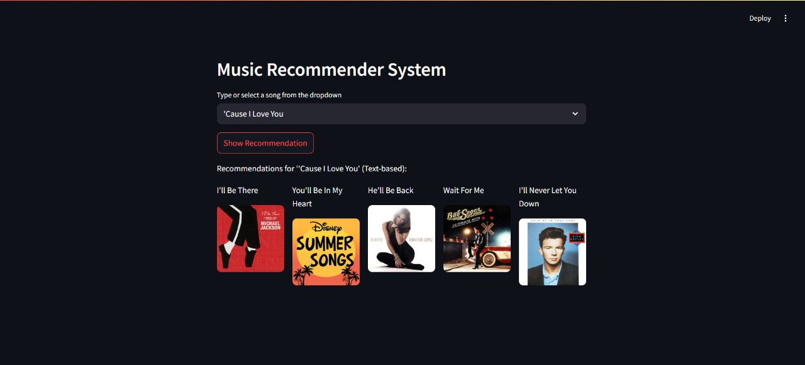
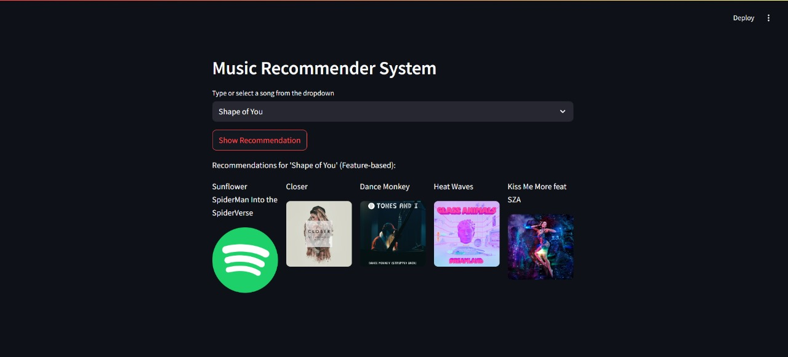

# 🎧 Song Recommender System

This project builds a **hybrid song recommender system** that suggests tracks based on either **lyrics** (text-based) or **audio features** (feature-based). It uses NLP and machine learning techniques to personalize recommendations.

A simple, interactive **Streamlit UI** allows users to input a song and instantly see recommendations.

---

## 🧠 Recommendation Approaches

1. **🎵 Text-Based Recommendations**  
   - Uses **TF-IDF vectorization** on song lyrics.
   - Computes **cosine similarity** via **K-Nearest Neighbors** to find lyrically similar tracks.
   - Based on the **Spotify Million Playlist Dataset**.

2. **📊 Feature-Based Recommendations**  
   - Uses features like `danceability`, `energy`, `acousticness`, `tempo`, `popularity`, etc.
   - Applies **StandardScaler** + **KNN** on numerical values.
   - Based on a dataset of **popular streaming songs**.

> If a song is not found in the lyrics dataset, the system defaults to the feature-based model.

---

## 🖥️ Tech Stack

- Python 🐍
- Scikit-learn
- NLTK (for text preprocessing)
- Pandas, NumPy
- Streamlit 🌐 (Frontend)

---

## 🚀 Getting Started

### ✅ Prerequisites
- Python 3.6+
- `streamlit`, `scikit-learn`, `pandas`, `nltk`, etc.
- Datasets: `songdata.csv`, `popular_songs.csv`

### 📦 Installation

```
# Clone the repository
git clone https://github.com/Shresth-Agarwal/Song-Recommender-System.git
cd Song-Recommender-System
```
# Install dependencies
``` pip install -r requirements.txt```
### 💡 Run the Streamlit App

```
streamlit run app.py
```
✅ Make sure the following files are in the same directory as `app.py`:

*   `songdata.csv`
*   `popular_songs.csv`

Once the app launches, it will open automatically in your web browser. You can enter a song title to receive music recommendations.

---

📓 Running on Google Colab

Open `Song_Recommendation_System.ipynb` in Google Colab.

Upload the required datasets or mount Google Drive.

Run all cells sequentially to train and use the recommendation logic.

---

🧪 Usage

🖱️ Using the Web App

1.  Enter a song title in the text box.
2.  View similar song suggestions generated by either:
    *   🎵 Lyrics-based similarity, or
    *   📊 Audio feature similarity (fallback).

🧑‍💻 Using the Notebook

Once you’ve executed the notebook cells, call the `recommender` function like this:
```
python recommender("Shape of You")
```
---

📂 Datasets Used

*   `songdata.csv`: Contains song lyrics and metadata.
*   `popular_songs.csv`: Includes features like danceability, energy, tempo, and popularity.

---

🤝 Contributing

Contributions are welcome! Feel free to:

*   Open an issue
*   Suggest new features
*   Submit a pull request 🚀

---

📜 License

This project is licensed under the MIT License.

---

🙏 Acknowledgments

*   Million Song Dataset
*   Spotify API Feature Documentation
*   NLTK
*   Streamlit
*   IIIT-Hyderabad AIML course for foundational concepts 🙌

---

📸 Demo Preview


